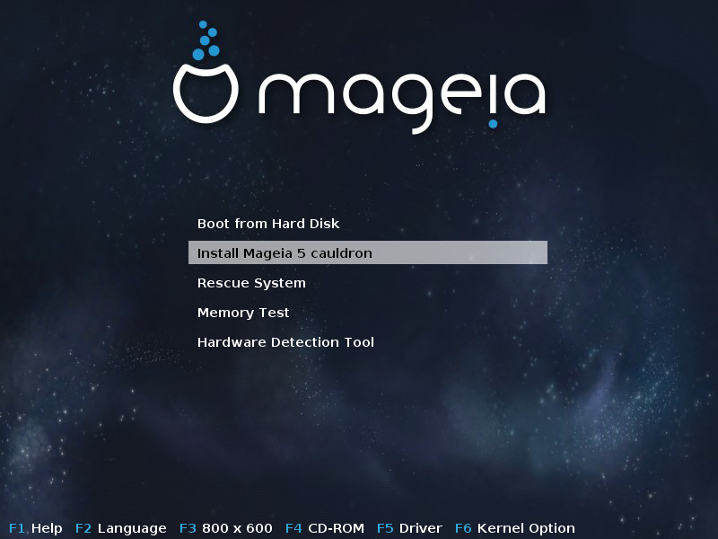
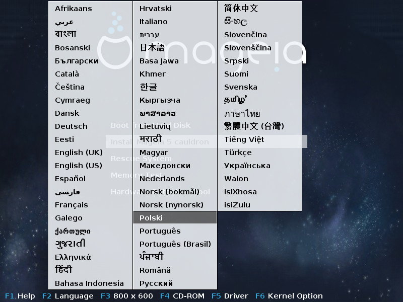
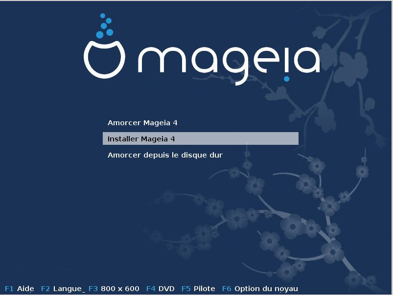
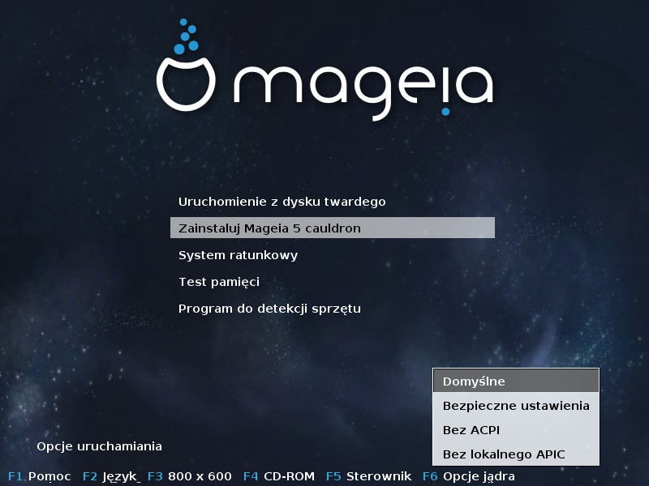
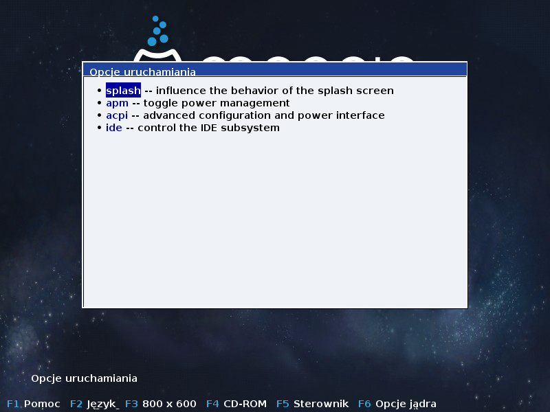
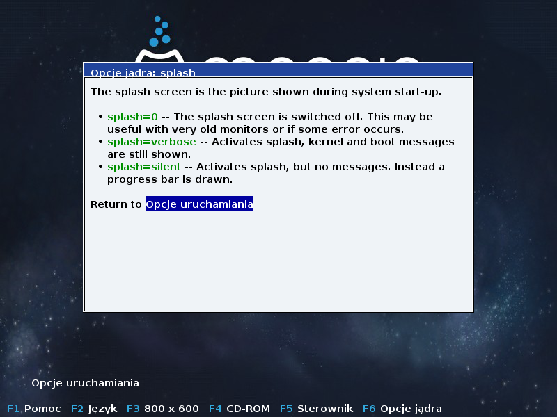
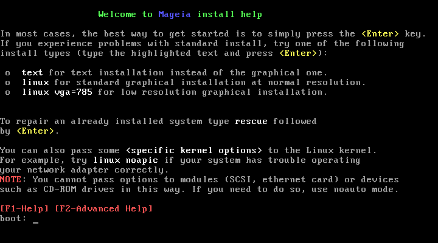

# DrakX instalator Mageia

Niezależnie czy jesteś początkującym, czy zaawansowanym użytkownikiem GNU/Linux, instalator Magei jest zaprojektowany tak, aby uczynić instalację lub aktualizację łatwą i przyjemną.

Pierwszy ekran instalatora zawiera różne opcje, jednak opcja zaznaczona domyślnie rozpoczyna instalację i zazwyczaj będzie to wszystko czego potrzebujesz.

Już na pierwszym ekranie instalatora można ustawić niektóre parametry instalacji:

* **Język** (tylko dla procesu instalacji, może być inny niż ten, który wybierzesz dla zainstalowanego systemu) poprzez wciśnięcie klawisza **F2**

Użyj strzałek aby wybrać język i naciśnij ENTER.

Dla przykładu zaprezentowany jest ekran powitalny w języku francuskim, pochądzący z wersji LiveDVD.
Zauważ, że menu LiveCD/DVD nie zawiera pozycji: **System ratunkowy**, **Test pamięci** oraz **Program do detekcji sprzętu**

* Aby zmienić rozdzielczość ekranu wciśnij **F3**

* Za pomocą klawisza **F6** możemy ustawić paramatry dla jądra

Jeśli instalacja się nie powiedzie, może zajść potrzeba uruchomienia jej z jedną z tych dodatkowych opcji. Menu wywoływane klawiszem **F6** wyświetli nam nową linię **Opcje uruchamiania** oraz zaproponuje cztery opcje:
1. **Domyślne** - nie zmienia żadnej z domyślnych opcji.
2. **Bezpieczne ustawienia** - nadaje priorytet opcjom bezpiecznym kosztem wydajności.
3. **Bez ACPI** - bez zarządzania energią.
4. **Bez lokalnego APIC** - ma związek z przerwaniami procesora.

Gdy wybierzemy jedną z tych pozycji, zmienione zostaną domyślne opcje prezentowane w linii **Opcje uruchamiania**

* Jeszcze więcej opcji dla jądra znajdziemy pod klawiszem **F1**

Wciśnięcie **F1** otwiera nowe okno z jeszcze kilkoma opcjami. Wybieramy za pomocą strzałek, wciśnięcie **ENTER** pokazuje szczegóły, a **ESC** umożliwia powrót do ekranu startowego.

Szczegółowy widok okna opcji. Wciśnij ESC lub wybierz Powrót do **Opcje uruchamiania**, aby wrócić do listy. Te opcje mogą zostać dodane ręcznie do linii **Opcje uruchamiania**.

Na poniższym obrazku zaprezentowany jest domyślny ekran startowy, gdy używana jest **Sieciowa płyta instalacyjna CD** (obrazy boot.iso lub boot-nonfree.iso). Ta wersja nie pozwala na zmianę języka, dostępne opcje przedstawione są na obrazku. Więcej na temat używania sieciowej płyty instalacyjnej CD CD można dowiedzieć się na [wiki Mageia](https://wiki.mageia.org/en/Boot.iso_install).

##Etapy instalacji

Proces instalacji jest podzielony na kilka etapów, możesz je śledzić po lewej stronie ekranu instalatora.

Każdy etap zawiera jeden lub więcej ekranów, które mogą także mieć przycisk **Zaawansowane**, który umożliwia dostęp do rzadziej używanych opcji.

Większość ekranów posiada przycisk **Pomoc**, który pozwala na zapoznanie się z wyjaśnieniami dotyczącymi aktualnego etapu instalacji.

---

***Notatka***

Jeśli w którymś momencie instalacji zdecydujesz się ją przerwać, istnieje możliwość ponownego uruchomienia komputera, lecz należy sie nad tym poważnie zastanowić. W chwili gdy partycje zostały już sformatowane lub rozpoczęła się instalacja pakietów, twój komputer nie jest już w takim samym stanie jak wcześniej, ponowne uruchomienie w tym momencie najprawdopodobniej spowoduje, że system nie będzie zdatny do użytku. Jeśli masz pewność, że chcesz ponownie uruchomić komputer, możesz przejśc do terminala tekstowego wciskając jednocześnie klawiszeAlt Ctrl F2. Następnie zrebootuj komputer za pomocą klawiszy Alt Ctrl Delete.

---

### Problemy z instalacją oraz możliwe rozwiązania
####Brak graficznego interfejsu

* Po ekranie powitalnym nie wyświetla się ekran wyboru języka. To może się zdarzyć w przypadku niektórych kart graficznych lub starszych komputerów. Spróbuj użyć niskiej rozdzielczości wpisując w linii komend **vgalo**.

* Jeśli sprzęt jest naprawdę stary, może się zdarzyć że instalacja w trybie graficznym nie będzie możliwa. W takim wypadku warto wypróbować instalacji w trybie tekstowym. Można ją uruchomić wciskając **ESC** podczas wyświetlania ekranu startowego i potwierdzenie wyboru klawiszem **ENTER**. Wyświetlony zostanie czarny ekran z napisem **boot:**. Wpisujemy **text** i zatwierdzamy klawiszem **ENTER**. Możemy kontynuować instalację w trybie tekstowym.

####Zawieszenie się instalacji

Jeśli system zawiesi się podczas instalacji, może to oznaczać problem z detekcją sprzętu. W tym przypadku automatyczna detekcja sprzętu może zostać pominięta. Wpisz w linii komend **noauto**. Ta opcja może być łączona z innymi opcjami jeśli zajdzie taka potrzeba.

####Problem z pamięcią RAM

To są rzadkie przypadki, jednak czasem zdarza się, że system zgłasza niepoprawnie ilość dostępnej pamięci RAM. Aby określić ją manualnie wpisz parametr **mem=xxxM**, gdzie xxx jest poprawną ilością dostępnej pamięci RAM wyrażoną w MB, np. **mem=256M **oznacza 256MB.

