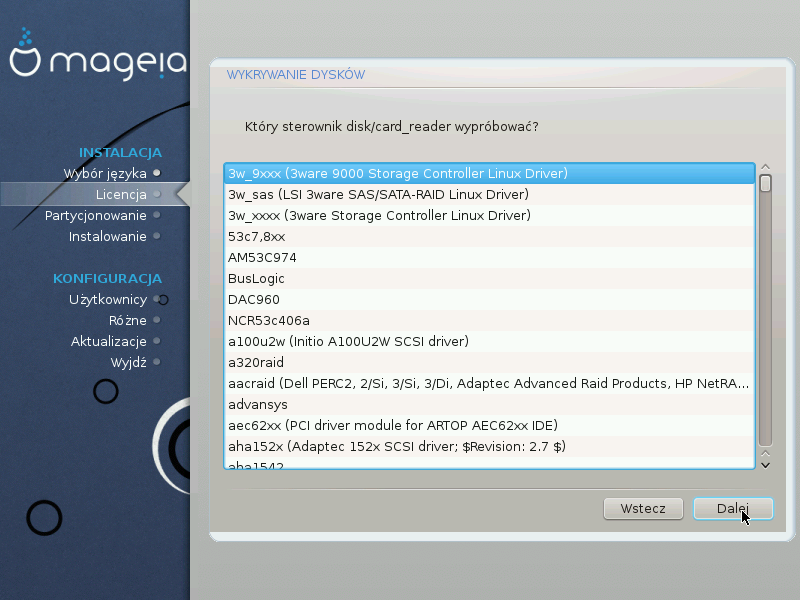

# Wykrywanie SCSI

Zazwyczaj DrakX wykrywa twarde dyski poprawnie. Jednak w przypadku niektórych starszych kontrolerów SCSI może nie być w stanie wykryć odpowiedniego sterownika i w efekcie nie rozpoznać dysku.

Jeśli zaistnieje taka sytuacja, zostaniesz poproszony, aby ręcznie wskazać, który dysk SCSI posiadasz.

DrakX powinien być wtedy w stanie odpowiednio skonfigurować dysk(i).
