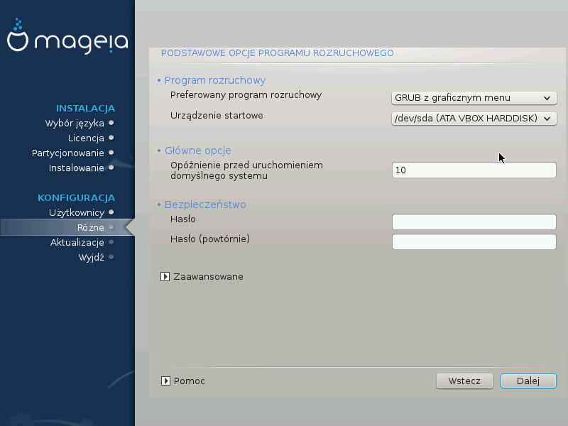

# Podstawowe opcje programu rozruchowego

Jeśli preferujesz inne ustawienia programu rozruchowego niż te zaproponowane przez instalator, możesz je tutaj ustawić.

Jeśli masz już zainstalowany inny system operacyjny na swojej maszynie, możesz chcież zdecydować, czy dodać Mageię do istniejącego już programu rozruchowego, czy pozwolić Magei na utworzenie nowego.

###Użycie bootloadera Magei

Domyślnie Mageia tworzy nowy program rozruchowy GRUB (legacy) w sektorze MBR (Master Boot Record) pierwszego dysku twardego. Jeśli masz już zainstalowany inyy system operacyjny, Mageia próbuje go wykryć i dodać do nowego menu startowego.

Mageia pozwala także na użycie programu rozruchowego GRUB2.

---

***Ostrzeżenie***

Systemy Linux, które używają bootloadera GRUB2, nie są obecnie wykrywane przez GRUB (legacy) i nie będą dodane do menu rozruchowego jeśli użyjemy domyślnego bootloadera.

Najlepszym rozwiązaniem w takim przypadku będzie użycie bootloadera GRUB2.

---

###Użycie istniejącego programu rozruchowego

Jeśli zdecydujesz się na użycie istniejącego programu rozruchowego, musisz pamiętać aby ZATRZYMAĆ SIĘ na etapie instalacji **Różne**, i kliknąć **Konfiguruj** przy pozycji
**Program rozruchowy**, co pozwoli ci na zmianę parametrów instalacji bootloadera.

Nie wybieraj urządzenia np. **sda**, bo w ten sposób nadpiszesz istniejący program rozruchowy w sektorze MBR. Musisz wybrać partycję główną (root), którą wcześniej utworzyłeś podczas partycjonowania, np. **sda7**.

Pamiętaj, **sda** oznacza urządzenie (dysk), zaś **sda7** oznacza konkretną partycję znajdującą się na tym urządzeniu (dysku).

---

***Podpowiedź***

Przejdź na terminal znakowy za pomocą **Ctrl+Alt+F2** i wpisz polecenie **df**, aby sprawdzić gdzie znajduję się partycja **/** (root). **Ctrl+Alt+F7** pozwoli ci nna powrót do ekranu instalacyjnego.

---

Procedura dodawania systemu Mageia do istniejącego programu rozruchowego wykracza poza zakres tej dokumentacji, jednak w większości wypadków sprowadza się ona do odpowiedniego programu instalującego dany bootloader, który powinien wykryć instalację Magei automatycznie. Sprawdź dokumentację używanego przez ciebie innego systemu operacyjnego.

###Zaawansowane opcje bootloadera

Jeśli masz bardz mało miejsca na partycję **/** i zawiera ona  **/tmp**, kliknij **Zaawansowane** i zaznacz opcję **Wyczyść /tmp przy każdym uruchomieniu**. Pozwala to zachować troszkę więcej wolnego miejsca.
