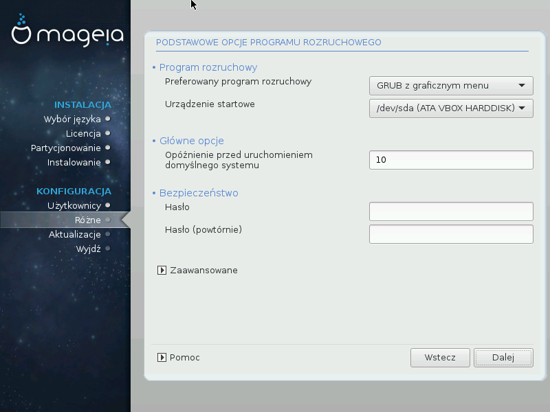

# Podstawowe opcje programu rozruchowego

If you prefer different bootloader settings to those chosen automatically by the installer, you can change them here.

You may already have another operating system on your machine, in which case you need to decide whether to add Mageia to your existing bootloader, or allow Mageia to create a new one.

---

***Podpowiedź***

The Mageia graphical menus are nice :)

---

###Using a Mageia bootloader

By default, Mageia writes a new GRUB (legacy) bootloader into the MBR (Master Boot Record) of your first hard drive. If you already have other operating systems installed, Mageia attempts to add them to your new Mageia boot menu.

Mageia now also offers GRUB2 as an optional bootloader in addition to GRUB legacy and Lilo.

---

***Ostrzeżenie***

Linux systems which use the GRUB2 bootloader are not currently supported by GRUB (legacy) and will not be recognised if the default GRUB bootloader is used.

The best solution here is to use the GRUB2 bootloader which is available at the Summary page during installation.

---

###Using an existing bootloader

If you decide to use an existing bootloader then you will need to remember to STOP at the summary page during the installation and click the Bootloader Configure button, which will allow you to change the bootloader install location.

Do not select a device e.g."sda", or you will overwrite your existing MBR. You must select the root partition that you chose during the partitioning phase earlier, e.g. sda7.

To be clear, sda is a device, sda7 is a partition on that device.

---

***Podpowiedź***

Go to tty2 with Ctrl+Alt+F2 and type df to check where your / (root) partition is. Ctrl+Alt+F7 takes you back to the installer screen.

---

The exact procedure for adding your Mageia system to an existing bootloader is beyond the scope of this help, however in most cases it will involve running the relevant bootloader installation program which should detect and add it automatically. See the documentation for the operating system in question.

###Bootloader advanced option

If you have very limited disk space for the **/** partition that contains **/tmp**, click on Advanced and check the box for Clean **/tmp** at each boot. This helps to maintain some free space.
