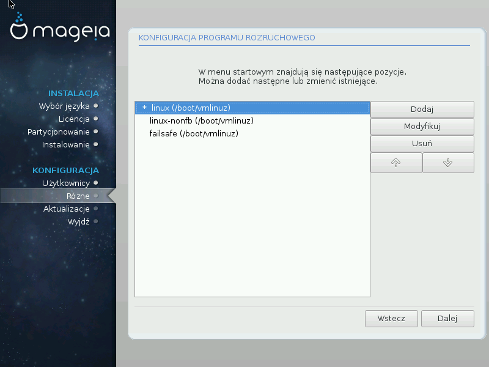
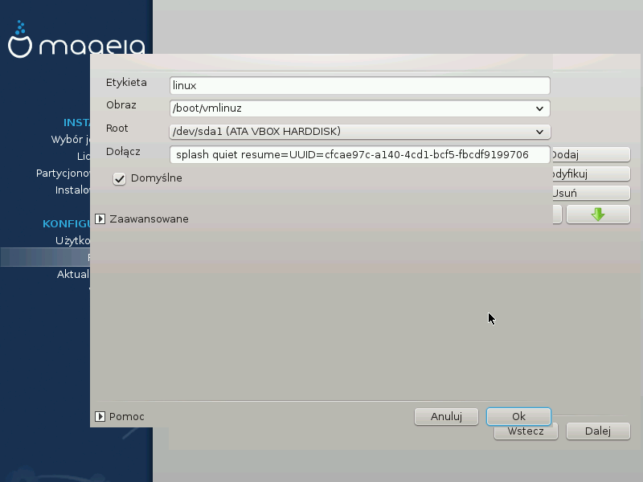

# Modyfikowanie Boot menu

You can add an entry or modify the one you select first, by pressing the relevant button in the Bootloader Configuration screen and editing the screen that pops up on top of it.

---

***Notatka***

If you have chosen Grub 2 as your bootloader, you cannot use this tool to edit entries at this step, press 'Next'. You need to manually edit /boot/grub2/custom.cfg or use grub-customizer instead.

---

Some things that can be done without any risk, are changing the label of an entry and ticking the box to make an entry the default one.

You can add the proper version number of an entry, or rename it completely.

The default entry is the one the systems boots into if you don't make a choice while booting up.

---

***Ostrzeżenie***

Editing other things can leave you with an unbootable system. Please don't just try something without knowing what you are doing.

---
