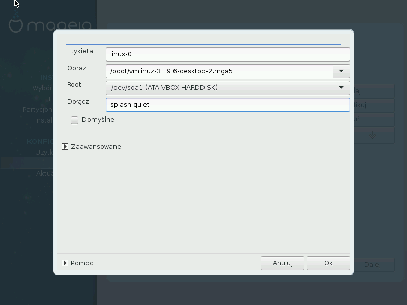

# Modyfikowanie menu programu rozruchowego


Możesz dodawać lub modyfikować istniejące pozycje menu programu rozruchowego.

---

***Notatka***
Jeśli wybrałeś **GRUB2** jako swój program rozruchowy, nie używaj tego narzędzia aby edytować pozycje w menu bootloadera. Wciśnij **Dalej**. GRUB2 można konfigurować po instalacji, poprzez ręczne modyfikowanie pliku ```
/boot/grub2/custom.cfg```
 lub też za pomocą programu **grub-customizer**.

---



Opcje które możesz bezpiecznie tutaj zmienić to **Etykieta** oraz zaznaczenie opcji **Domyślne**.

Domyślna pozycja to taka, która zostanie uruchomiona jeśli nie dokonasz innego wyboru podczas uruchamiania systemu.

---

***Ostrzeżenie***

Edytowanie pozostałych pozycji może spowodować, że system nie będzie w stanie się uruchomić. Więc nie próbuj tutaj kombinować, jeśli nie do końca wiesz co robisz.

---
