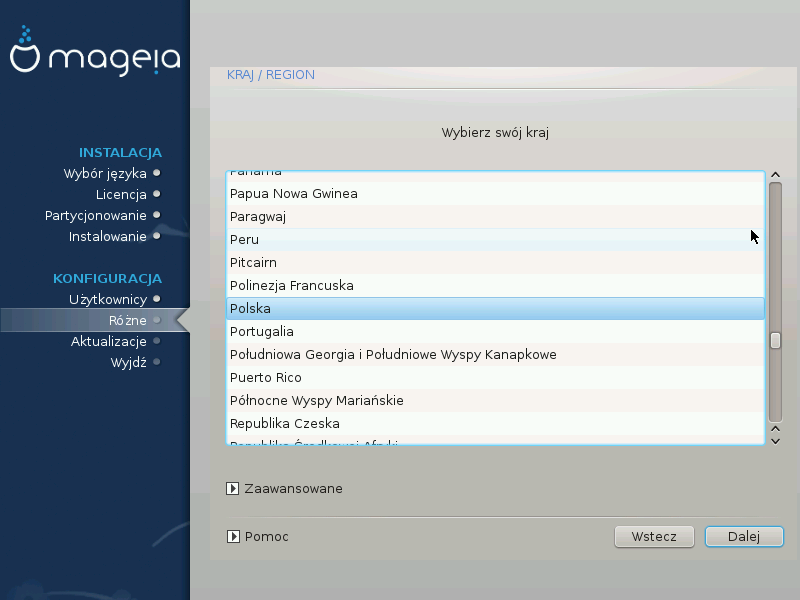

# Kraj/Region

Select your country or region. This is important for all kinds of settings, like the currency and wireless regulatory domain. Setting the wrong country can lead to not being able to use a Wireless network.

If your country isn't in the list, click the Other Countries button and choose your country / region there.

---

***Notatka***

If your country is only in the Other Countries list, after clicking OK it may seem a country from the first list was chosen. Please ignore this, DrakX will follow your real choice.

---

###Input method

In the Other Countries screen you can also select an input method (at the bottom of the list). Input methods allow users to input multilingual characters (Chinese, Japanese, Korean, etc). IBus is the default input method in Mageia DVDs, Africa/India and Asia/no-India Live-CDs. For Asian and African locales, IBus will be set as default input method so users should not need to configure it manually. Other input methods(SCIM, GCIN, HIME, etc) also provide similar functions and can be installed if you added HTTP/FTP media before package selection.

---

***Notatka***

If you missed the input method setup during installation, you can access it after you boot your installed system via "Configure your Computer" -> "System", or by running localedrake as root.

---
