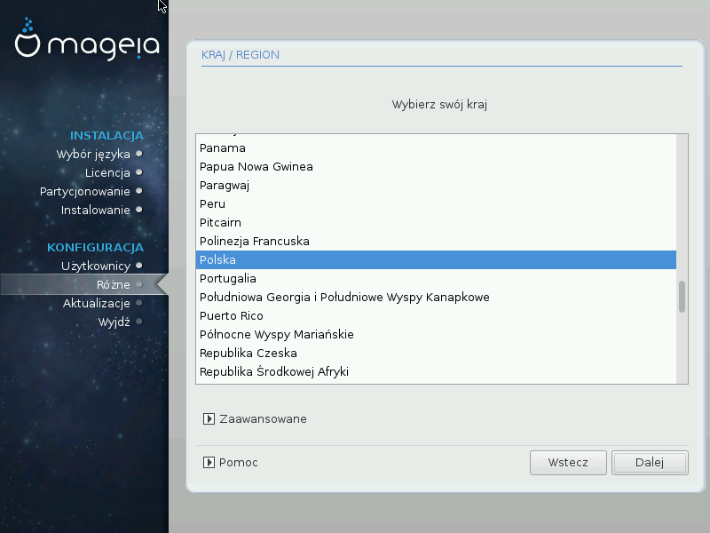

# Kraj/Region

Wybierz swój kraj lub region. To jest istotne ze względu na inne ustawienia, jak waluta, sposób wyślwietlania daty czy domena dla urządzeń bezprzewodowych. Ustawienie nieodpowiedniego kraju może spowodować, że nie będziesz w stanie korzystać z sieci bezprzewodowych.
Jeśli twojego kraju nie ma na liście, kliknij **Inne kraje** i tam wybierz swój kraj / region.

###Input method

In the Other Countries screen you can also select an input method (at the bottom of the list). Input methods allow users to input multilingual characters (Chinese, Japanese, Korean, etc). IBus is the default input method in Mageia DVDs, Africa/India and Asia/no-India Live-CDs. For Asian and African locales, IBus will be set as default input method so users should not need to configure it manually. Other input methods(SCIM, GCIN, HIME, etc) also provide similar functions and can be installed if you added HTTP/FTP media before package selection.

---

***Notatka***

If you missed the input method setup during installation, you can access it after you boot your installed system via "Configure your Computer" -> "System", or by running localedrake as root.

---
