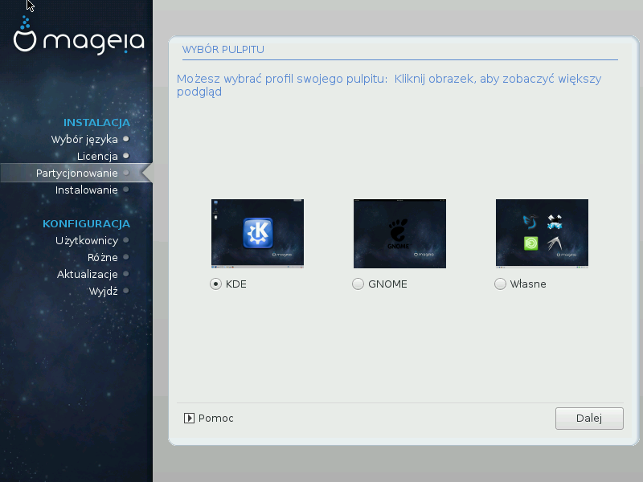

# Wybór pulpitu
W zależności od wyboru którego tutaj dokonasz, możesz zobaczyć dalsze ekrany, aby dokonać dalszych ustawień instalacji.

Po wyborze pulpitu, podczas instalacji pakietów zobaczysz pokaz slajdów. Może on być wyłączony poprzez kliknięcie przycisku **Szczegóły**.

Możesz wybrać środowisko graficzne **KDE** lub **GNOME**. Oba z nich zawierają pełny zestaw użytecznych programów i narzędzi.

Wybierz **Własne** jeśli nie chcesz żadnego z nich lub chcesz wybrać oba, lub jeśli chcesz wybrać inne środowisko.

**LXDE** jest zdecydowanie lżejsze, lecz oferuje nieco mniejszą funkcjonalność oraz mniej domyślnie zainstalowanych programów.

Dostępnę są również środowiska: **Xfce**, **MATE**, **Cinnamon**.
