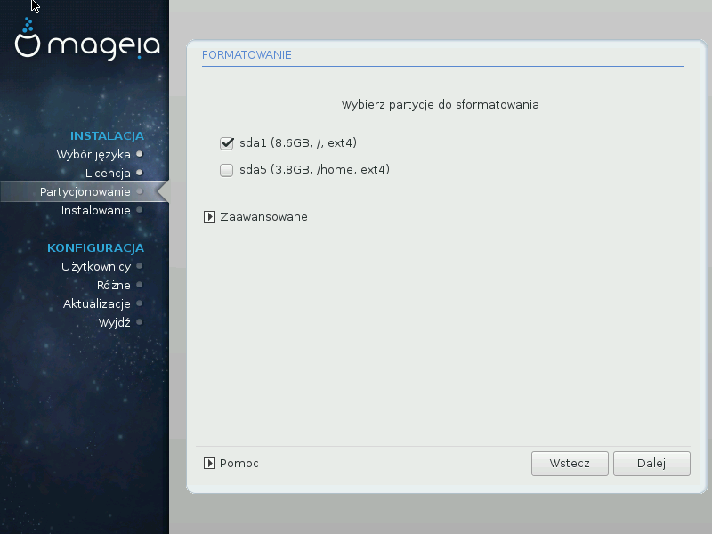

# Formatowanie

Tutaj możesz wybrać, które partycje chcesz sformatować. Wszystkie dane na partycjach *nie zaznaczonych* do formatowania zostaną zachowane.

Zazwyczaj przynajmniej te partycje, które zaznaczył instalator, powinny być sformatowane.

Kliknij na **Zaawansowane** aby wybrać, które partycje mają zostać sprawdzone na obecność tzw. bad bloków.

---

***Podpowiedź***

Jeśli nie jesteś pewien swojego wyboru, możesz kliknąć **Wstecz**, jeszcze raz **Wstecz**, a następnie **Zaawansowany podział na partycje**, aby dostać się do głównego okna. Na tym ekranie możesz sprawdzić co znajduje się na Twoich partycjach.

---

Jeśli jesteś zadowolony ze swojego wyboru, kliknij **Dalej** aby kontynuować.
