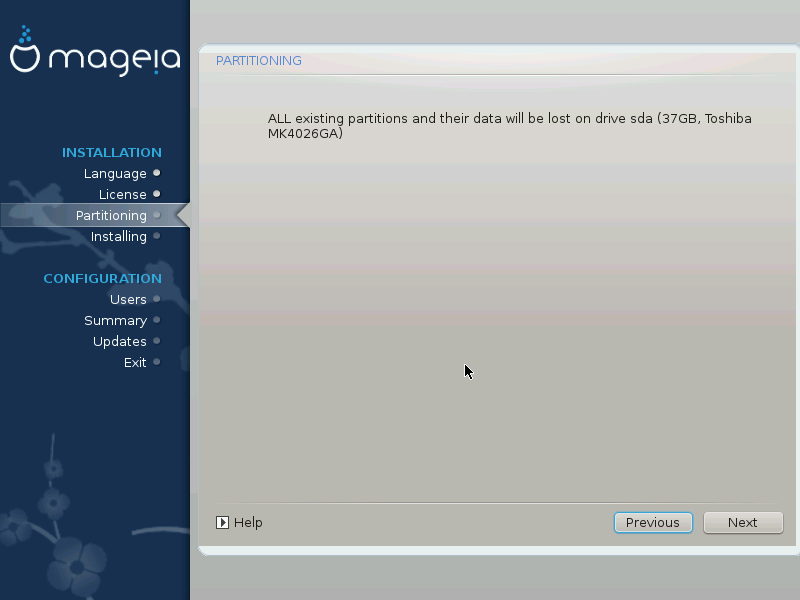

# Formatowanie twardego dysku

Kliknij **Wstecz** jeśli nie jesteś pewien swojego wyboru.

Kliknij **Dalej** jeśli jesteś pewien że chcesz wymazać każdą partycję, każdy system operacyjny oraz wszystkie dane z twardego dysku.
