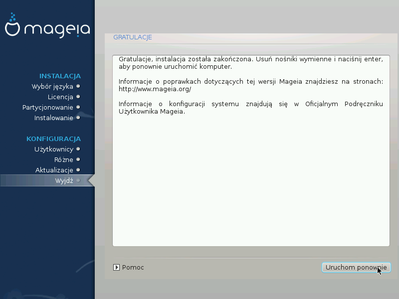

# Gratulacje

Instalacja i konfiguracja Magei została zakończona, teraz można bezpiecznie usunąć nośnik instalacyjny i uruchomić komputer ponownie.

Po restarcie komputera, pojwi się ekran bootloadera (programu rozruchowego), na którym możesz wybrać jaki system operacyjny chcesz uruchomić (jeśli posiadasz więcej niż jeden).

Jeśli nie zmieniałeś nic w ustawieniach programu rozruchowego, twój nowy system Mageia będzie wybrany automatycznie oraz zostanie uruchomiony.

Dobrej zabawy!

Jeśli masz jakieś pytania, bądź chciał(a)byś dołączyć do pojektu Mageia - odwiedź stronę [www.mageia.org](http://www.mageia.org).
