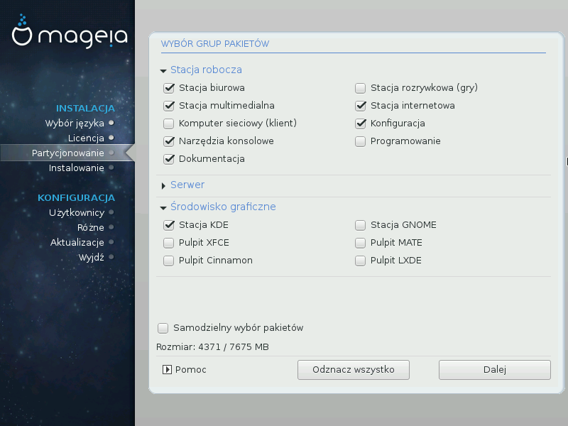

# Wybór grup pakietów

Aby ułatwić ci wybór, pakiety zostały podzielone na grupy. Nazwy grup nie wymagają objaśnień, jednak więcej informacji o każdej z nich możesz uzyskać najeżdżając na nie myszą.

* **Stacja robocza**

* **Serwer**

* **Środowisko graficzne**

* **Samodzielny wybór pakietów**: możesz zaznaczyć tą opcję jeśli chcesz samodzielnie dodawać lub usuwać pojedyńcze pakiety.

Przeczytaj [Minimalna instalacja](./minimal.md), aby dowiedzieć się jak przeprowadzić instalację minimalną.
