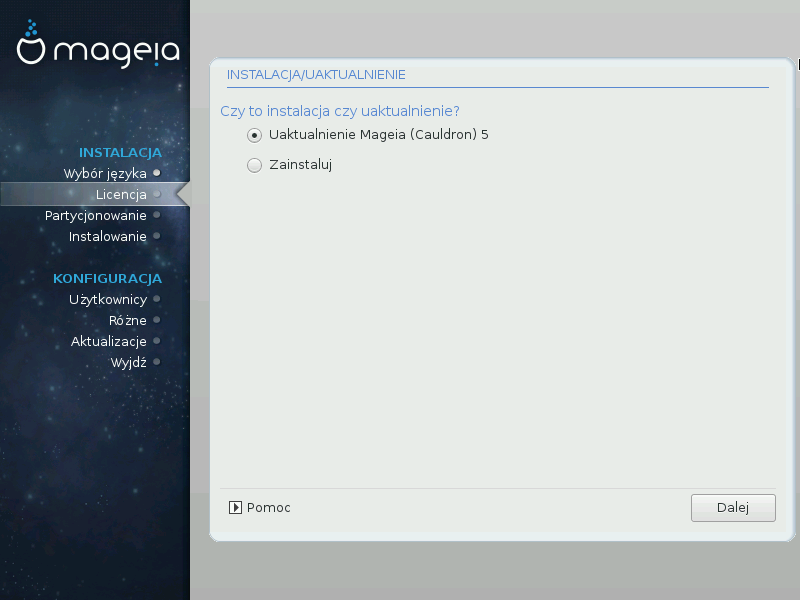

# Instalacja czy uaktualnienie

* Zainstaluj

    Użyj tej opcji dla świeżej instalacji Mageia.

*  Uaktualnienie

    Jeśli masz jedną lub więcej instalacji Magei w swoim komputerze, instalator pozwala na uaktualnienie jednej z nich do najnowszej wersji.

---

***Ostrzeżenie***

Tylko uaktualnienie z poprzedniej wersji Magei, która była nadal wspierana, w momencie ukazania się wersji którą chcesz instalować, została gruntownie przetestowana. Jeśli chcesz aktualizować starszą wersję Magei, zalecamy przeprowadzenie świeżej instalacji bez formatowania partycji **/home**.

---

***Notatka***

Jeśli podczas instalacji zdecydujesz się ją przerwać, jest taka możliwość, należy to jednak dobrze przemyśleć. Gdy są już sformatowane partycje lub gdy zaczęły już się instalować pakiety, twój komputer nie jest już w takim samym stanie jak przed instalacją, ponowne uruchomienie go w tej chwili może spowodować, że system będzie nieużywalny. Jeśli jesteś pewien, że przerwanie instalacji to dobry pomysł, przejdź do terminala za pomocą **Alt+Ctrl+F2**. Następnie wciśnij **Alt+Ctrl+Delete**, aby zrestartować komputer.

---

***Podpowiedź***

Jeśli zorientujesz się, że zapomniałeś wybrać dodatkowy język, możesz cofnąć się z ekranu **Instalacja/Uaktualnienie** do ekranu wyboru języka za pomocą **Alt+Ctrl+Home**. Nie próbuj tego podczas dalszych etapów instalacji.

---
