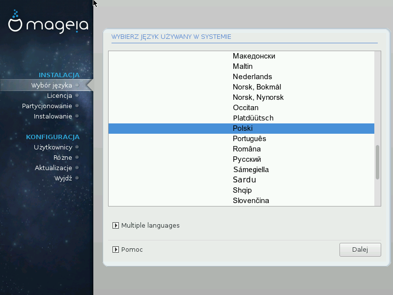

# Wybór języka
Wybierz preferowany język, najpierw rozwijając listę dla swojego kontynentu. Mageia będzie używać wybranego języka zarówno podczas instalacji jak i w zainstalowanym systemie.

Jeśli potrzebujesz mieć kilka języków zainstalowanych w systemie, dla siebie lub innych użytkowników, możesz użyć przycisku Więcej języków aby je teraz dodać.

---
***Ostrzeżenie***

Nawet jeśli chcesz zainstalować więcej niż jeden język, musisz najpierw wybrać jeden z nich jako domyślny w głównym oknie wyboru języka. Będzie on również zaznaczony jako domyślny w oknie wyboru wielu języków.

---

* Jeśli język twojej klawiatury nie jest taki sam jak język, który wybierasz jako domyślny, należy zainstalować także język odpowiedni do twojej klawiatury.

* Mageia używa domyślnie kodowania UTF-8 (Unikod). Jeśli wiesz, że to kodowanie nie jest odpowiednie dla twojego języka, możesz wyłączyć wsparcie dla UTF-8 w oknie "więcej języków". Będzie to dotyczyć wszystkich zainstalowanych języków.

* Po instalacji możesz zmienic domyslny język używany w systemie za pomocą Centrum Sterowania Mageia -> System -> Zarządzanie lokalizacją systemu.
