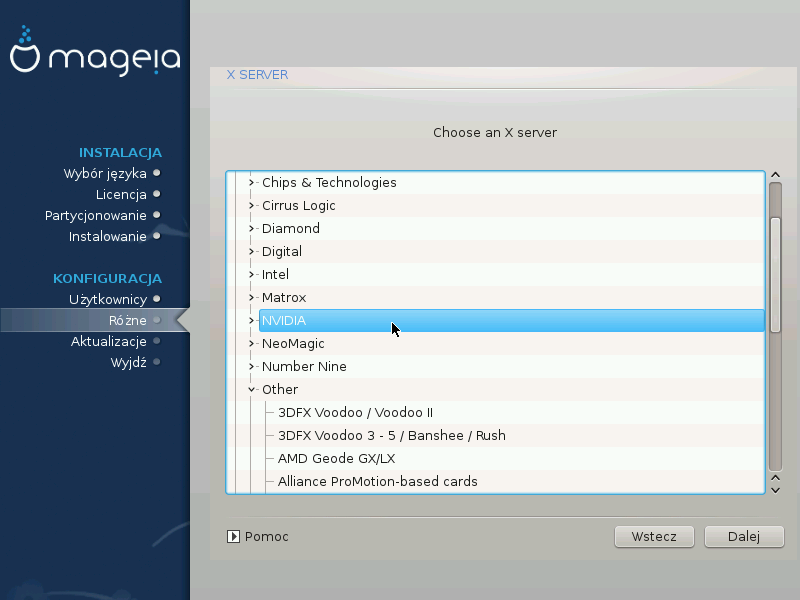

# Wybór serwera X (konfiguracja karty graficznej)

Instalator DrakX posiada bardzo obszerną bazę kart graficznych i zazwyczaj dobrze rozpoznaje dostępne urządzenia.

Jeśli instalator nie wykrył poprawnie Twojej karty graficznej, a wiesz jaki to model, możesz wybrać go z pomocą prezentowanego drzewka opcji:

* dostawca
* następnie nazwa karty
* oraz typ karty

Jeśli nie możesz odnaleźć swojej karty na liście dostawców (np. gdy jej jeszcze tam nie ma, lub jest to starsza karta) możesz znaleźć odpowiedni sterownik na liście Xorg.

Lista Xorg dostarcza ponad 40 ogólnych oraz otwartoźródłowych sterowników do kart graficznych. Jeśli nadal nie możesz wśród nich odnależź pasującego sterownika, pozostaje opcja użycia sterownika **vesa**, który zapewnia podstawowe funkcjonalności.

Pamiętaj, że jeśli wybierzesz niekompatybilny sterownik, możesz mieć dostęp tylko do trybu tekstowego (linii komend).

Niektórzy producenci kart graficznych udostępniają własnościowe sterowniki dla Linuksa, które mogą być umieszczone jedynie w repozytorium **Nonfree**, w niektórych przypadkach są one dostępne jedynie na stronie producenta.

Aby je zainstalować musi być włączone repozytorium **Nonfree**. Jeśli nie włączono tego repozytorium wcześniej, należy je włączyć po ponownym uruchomieniu komputera.
