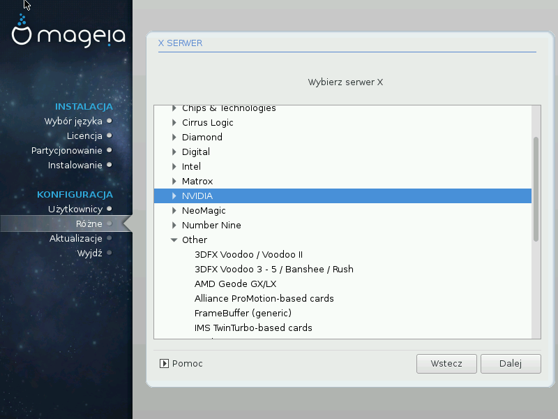

# Wybór serwera X (Konfiguracja kartygraficznej

DrakX has a very comprehensive database of video cards and will usually correctly identify your video device.

If the installer has not correctly detected your graphic card and you know which one you have, you can select it from the tree by:

* dostawca
* następnie nazwa karty
* oraz typ karty

If you cannot find your card in the vendor lists (because it's not yet in the database or it's an older card) you may find a suitable driver in the Xorg category

The Xorg listing provides more than 40 generic and open source video card drivers. If you still can't find a named driver for your card there is the option of using the vesa driver which provides basic capabilities.

Be aware that if you select an incompatible driver you may only have access to the Commandline Interface.

Niektórzy producenci kart graficznych udostępniają własnościowe sterowniki dla Linuksa, które mogą być umieszczone jedynie w repozytorium **Nonfree**, w niektórych przypadkach są one dostępne jedynie na stronie producenta.

Aby je zainstalować musi być włączone repozytorium **Nonfree**. Jeśli nie włączono tego repozytorium wcześniej, należy je włączyć po ponownym uruchomieniu komputera.
