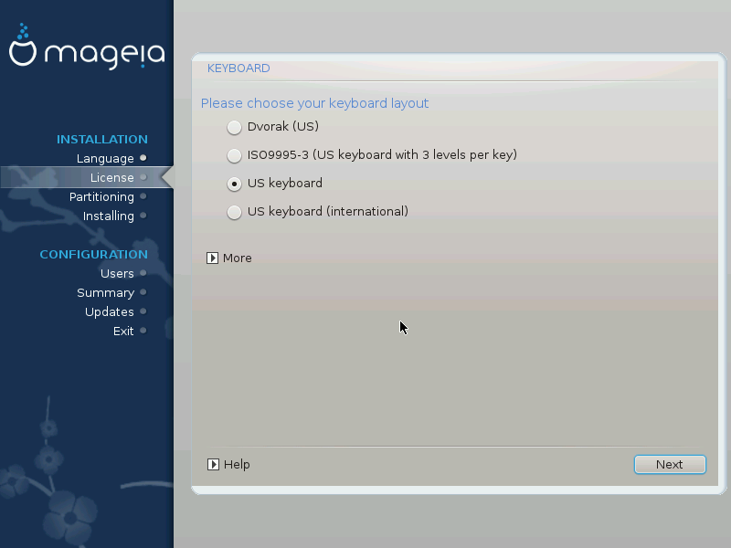

# Klawiatura
DrakX wybiera odpowiedni układ klawiatury do twojego języka. Jeśli nie znaleziono odpowiedniego układu klawiatury, wybrany będzie domyślny układ klawiatury US.

* Upewnij się, że zaproponowany wybór jest odpowiedni lub wybierz inny układ klawiatury. Jeśli nie wiesz jaki układ jest odpowiedni dla twojej klawiatury, sprawdź dokumentację lub zapytaj dostawcę sprzętu. Może się zdarzyć że na klawiaturze znajdziesz etykietę z potrzebną informacją. Możesz także sprawdzić: [en.wikipedia.org/wiki/Keyboard_layout](http://en.wikipedia.org/wiki/Keyboard_layout)

* Jeśli twoja klawiatura nie znajduje się na pokazanej liście, kliknij na More, aby zobaczyć pełną listę i wybrać z niej swoją klawiaturę.

* Jeśli wybierzesz klawiaturę bazującą na znakach  *non-Latin*, zobaczysz dodatkowy ekran z pytaniem w jaki sposób chcesz się przełączać pomiędzy układami klawiatury *Latin* a *non-Latin*.
