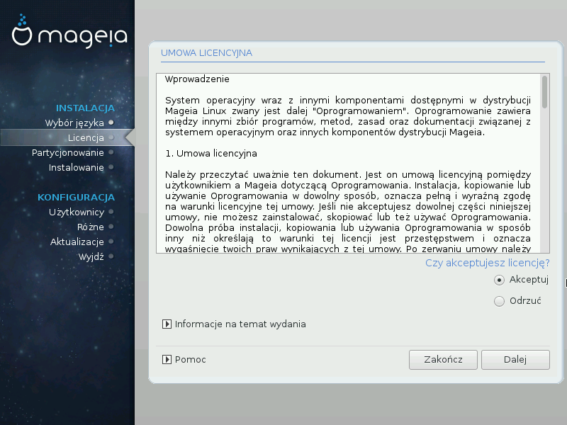

# Licencja oraz informacje o wydaniu

####Umowa licencyjna

Przed instalacją Mageia, proszę przeczytać uważnie warunki umowy licencyjnej.

Warunki umowy licencyjnej odnoszą się do całej dystrybucji Mageia i muszą być zaakceptowane przed kontynuacją instalacji.

Aby zaakceptować po prostu wybierz **Akceptuj** i kliknij **Dalej**.

Jeśli zdecydujesz że nie zgadzasz się na warunki licencji, dziękujemy za zainteresowanie. Kliknięcie **Zakończ** spowoduje ponowne uruchomienie komputera.

####Informacje o wydaniu

Aby zobaczyć co nowego w tym wydaniu Mageia, kliknij **Informacje na temat wydania**.
