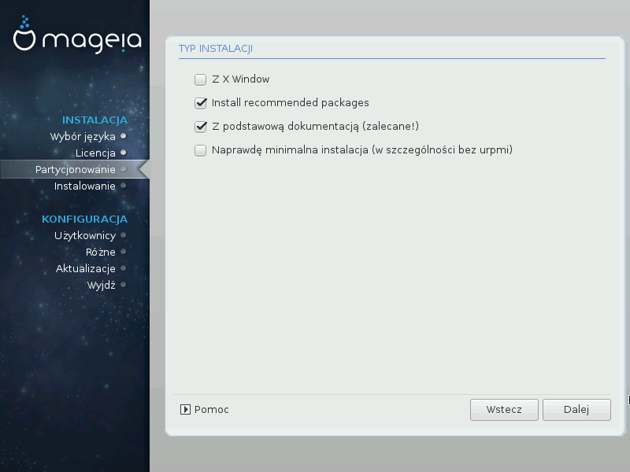

# Minimalna instalacja

Możesz przeprowadzić *minimalną instalację* poprzez odznaczenie wszystkich grup pakietów na ekranie Wybór grup pakietów, zobacz [Wybór grup pakietów](./groups.md).

Minimalna Instalacja jest przeznaczona dla osób, które mają specyficzny pomysł na instalację Magei, przykładowo serwer lub specjalistyczna stacja robocza. Jeśli użyjesz tej opcji to prawdopodobnie wraz z opcją samodzielnego wyboru pakietów, zobacz [Samodzielny wybór pakietów](./pakiety.md).

Jeśli wybierzesz ten typ instalacji, zostanie ci zaprezentowanych kilka użytecznych opcji, jak dokumentacja czy X Window.

