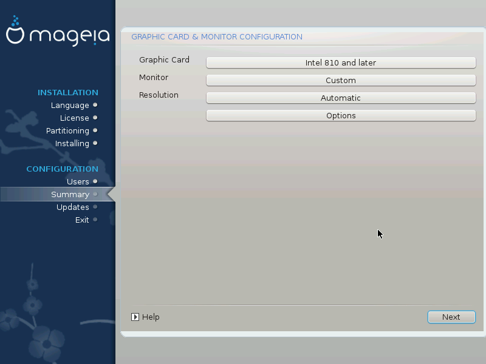

# Konfiguracja monitora i karty graficznej

Niezależnie jakie środowisko graficzne (zwane też pulpitem) wybierzesz dla swojej instalacji Magei, każde z nich korzysta z systemu graficznego nazywanego *X Window System*, lub po prostu *Xy*. Aby KDE, Gnome, LXDE lub jakiekolwiek inne środowisko graficzne działało dobrze pewne ustawienia X serwera muszą być poprawne. Wybierz odpowiednie ustawienia jeśli instalator tego nie zrobił, lub gdy uważasz że wybór jakiego dokanał instalator nie jest dobry.

* **Karta graficzna**: Wybierz swoją kartę graficzną z listy.

* **Monitor**: Możesz wybrać **Plug'n Play**, albo wybrać swój monitor z listy **Dostawca** lub listy **Standardowa**. Wybierz **Własne** jeśli chcesz samodzielnie ustawić częstotliwość synchronizacji pionowej i poziomej dla swojego monitora.

---

***Ostrzeżenie***

Niepoprawna wartość odświeżania może uszkodzić monitor.

---

* **Rozdzielczość**: Ustaw pożądaną rozdzielczość oraz głębię kolorów.

* **Test**: Przycisk **Test** nie zawsze pojawia się podczas instalacji. Jeśli jednak się pojawi, możesz przetestować swoje ustawienia. Gdy zobaczysz pytanie o to czy ustawienia są prawidłowe, możesz odpowiedzieć **Tak**, aby zapisać ustawienia. Gdy pytanie się nie pojawi, powrócisz do ekranu konfiguracji, gdzie możesz zmieniać różne ustawienia aż do momentu kiedy test się powiedzie.

* **Opcje**: Tutaj możesz włączyć lub wyłączyć różne opcje.
