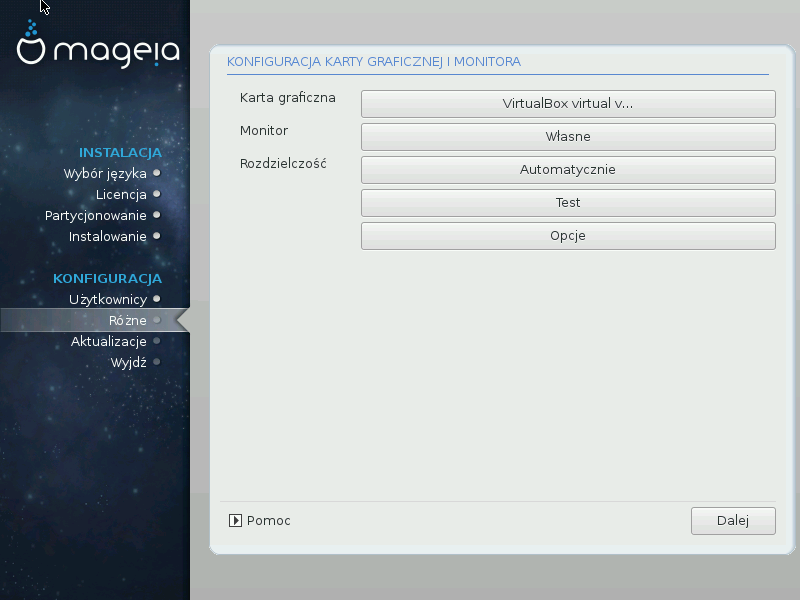

# Konfiguracja monitora i karty graficznej

No matter which graphical environment (also known as desktop environment) you chose for this install of Mageia, they are all based on a graphical user interface system called X Window System, or simply X. So in order for KDE, Gnome, LXDE or any other graphical environment to work well, the following X settings need to be correct. Choose the correct settings if you can see that DrakX didn't make a choice, or if you think the choice is incorrect.

* Karta graficzna: Wybierz swoją kartę graficzną z listy.

* Monitor: You can choose Plug'n Play when applicable, or choose your monitor from the Vendor or Generic list. Choose Custom if you prefer to manually set the horizontal and vertical refresh rates of your monitor.

---

***Ostrzeżenie***

    Niepoprawna wartość odświeżania może uszkodzić monitor

---

* Resolution: Set the desired resolution and color depth of your monitor here.

* Test: The test button does not always appear during install. If the button is there, you can control your settings by pressing it. If you see a question asking you whether your settings are correct, you can answer "yes", and the settings will be kept. If you don't see anything, you'll return to the configuration screen and be able to reconfigure everything until the test is good. Make sure your settings are on the safe side if the test button isn't available

* Options: Here you can choose to enable or disable various options.
