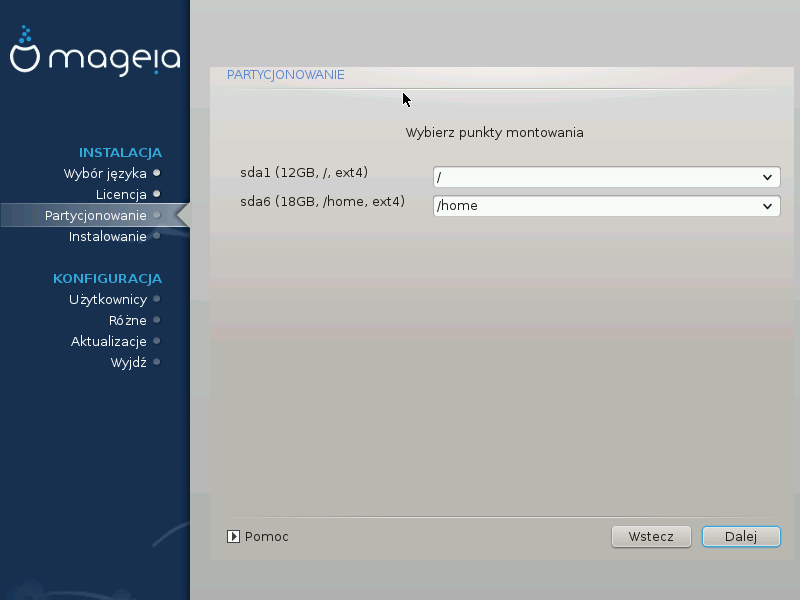

# Wybór punktów montowania

Tutaj zobaczysz partycje Linux, które zostały znalezione na Twoim komputerze. Jeśli nie zgadzasz się z sugestiami instalatora DrakX, możesz zmienić punkty montowania.

---

***Notatka***

Jeśli cokolwiek zmienisz, upewnij się że wciąż masz partycję **/** (root).

---

* Każda partycja jest ukazana jako: **Urządzenie** (**Pojemność**, **Punkt montowania**, **Typ**).

* **Urządzenie** jest przedstawione jako: **dysk twardy**, [**litera dysku**], **numer partycji** (dla przykładu: **sda5**).

* Jeśli masz wiele partycji, możesz wybrać wiele różnych punktów montowania z listy rozwijalnej, takich jak **/**, **/home** oraz **/var**. Możesz także tworzyć własne punkty montowania, na przykład **/video** dla partycji na której chcesz przechowywać swoje filmy.

* Możesz pozostawić punkt montowania pusty dla partycji, do których nie chcesz mieć dostępu.

---

***Informacja***

Kliknij **Wstecz** jeśli nie wiesz co zrobić, a następnie zaznacz **Zaawansowany podział na partycje**. Na ekranie który się pojawi można będzie kliknąć na partycję aby sprawdzić jej typ oraz rozmiar.

---

Jeśli jesteś pewny, że punkty montowania są dobrze ustawione, kliknij **Dalej**, by zdecydować które partycje sformatować.
