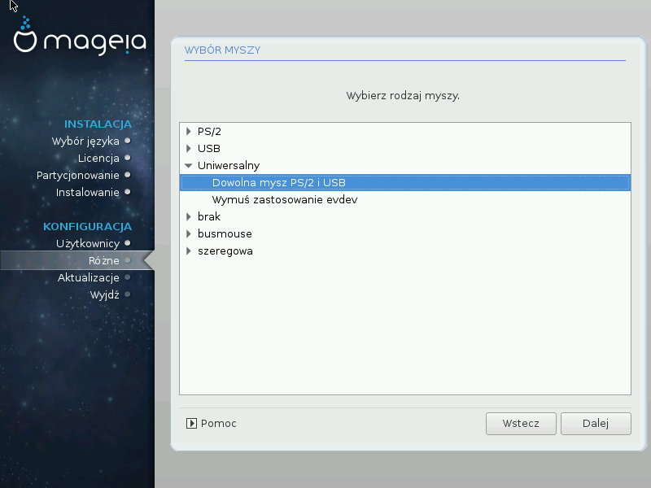

# Wybór myszy

Jeśli nie jesteś zadowolony z tego jak zachowuje się mysz, możesz tutaj wybrać inną.

Zazwyczaj, **Uniwersalny** - **Dowolna mysz PS/2 i USB** jest dobrym wyborem.

Wybierz **Uniwersalny** - **Wymuś zastosowanie evdev**, aby skonfigurować przyciski, które nie działają w myszy z sześcioma lub więcej przyciskami.
