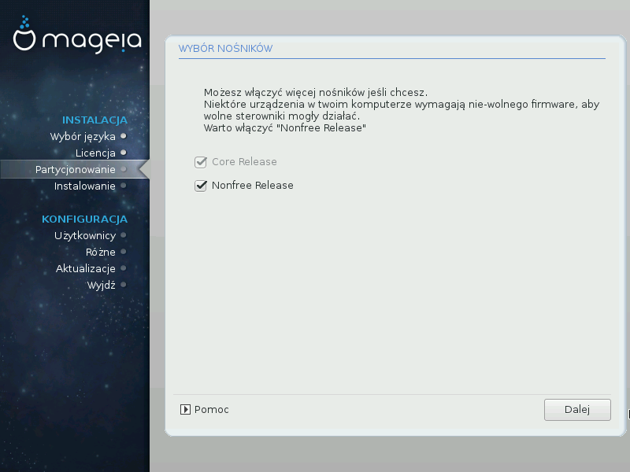

# Wybór nośników (Nonfree)

Tutaj znajduje się lista dostępnych repozytoriów. Nie wszystkie repozytoria są dostępne, zależy to od nośników jakie wykorzystujesz do instalacji. Wybór repozytoriów ma wpływ na to jakie pakiety będzie można zainstalować w następnych krokach.

* Repozytorium **Core** nie może zostać wyłączone ponieważ zawiera ono podstawowe pakiety dystrybucji.

* Repozytorium **Nonfree** zawiera pakiety wolne od opłat, które mogą być udostępniane przez Mageię, lecz zawierają oprogramowanie do którego źródła nie są dostępne (stąd nazwa - Nonfree). To repozytorium zawiera np. własnościowe sterowniki do kart graficznych nVidia oraz ATI, firmware dla niektórych kart WIFI, itp.

*  Repozytorium **Tainted** zawiera pakiety wydane na wolnych licencjach. Głównym powodem umieszczenia tych pakietów w tym repozytorium jest fakt, że mogą one naruszać prawa patentowe w niektórych krajach, np. kodeki multimedialne, pakiety potrzebne do odtwarzania komercyjnych płyt DVD, itp.
