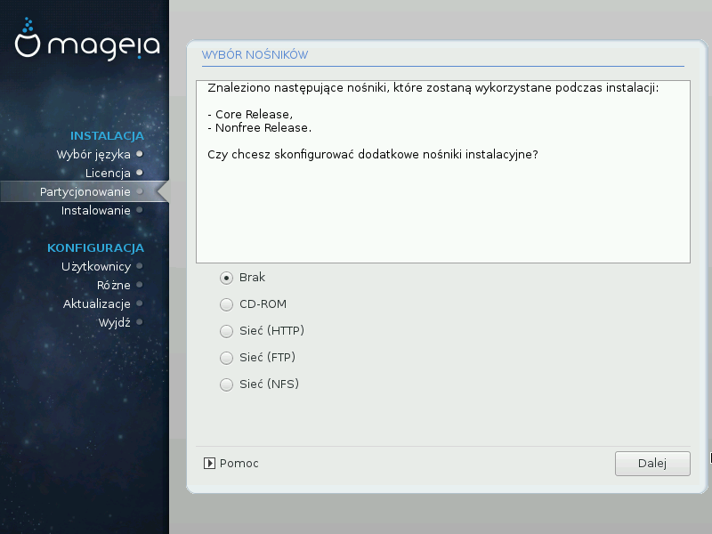

# Wybór nośników (konfiguracja dodatkowych nośników instalacyjnych)

Ten ekran pokazuje listę znalezionych nośników. Możesz dodać inne nośniki instalacyjne, jak dysk cd/dvd lub zdalny serwer sieciowy. Wybór źródeł (nośników) decyduje o tym jakie pakiety będą mogły zostać wybrane podczas następnych kroków.

Dla nośników sieciowych, wymagane są dwa kroki:

1. Wybór i aktywacja połączenia sieciowego, jeśli jeszcze nie zostało ustanowione.

2. Wybór mirrora lub podanie adresu URL. Wybierając mirror masz dostęp do wszystkich repozytoriów udostępnianych przez Mageię, jak **Nonfree**, **Tainted** oraz **Updates**. Za pomocą URL możesz określić jakiekolwiek repozytorium lub swój własny mirror np. NFS.
