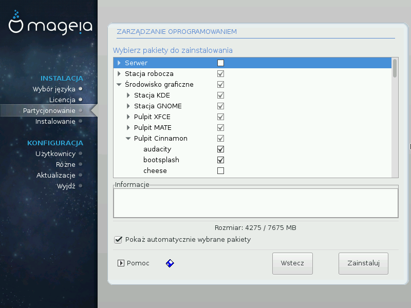

# Samodzielny wybór pakietów

Tutaj możesz dodawać lub usuwać jakie tylko chcesz pakiety, aby dostosować instalację do swoich potrzeb.

Po dokonaniu wyboru, możesz kliknąć na ikonę dyskietki na dole okna, aby zachować swój wybór pakietów (zapisywanie na dysku USB także działa). Możesz użyć tego pliku do instalacji tych samych pakietów na innym komputerze, naciskając tą samą ikonę i wybierając wczytanie pliku.
