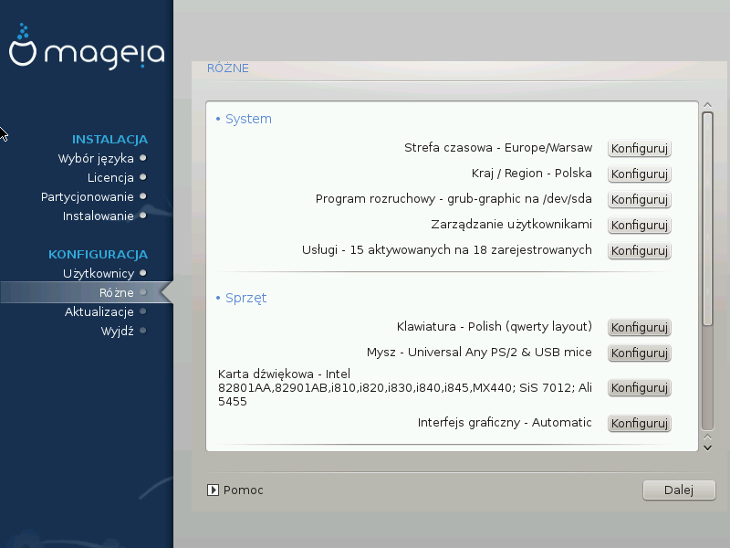
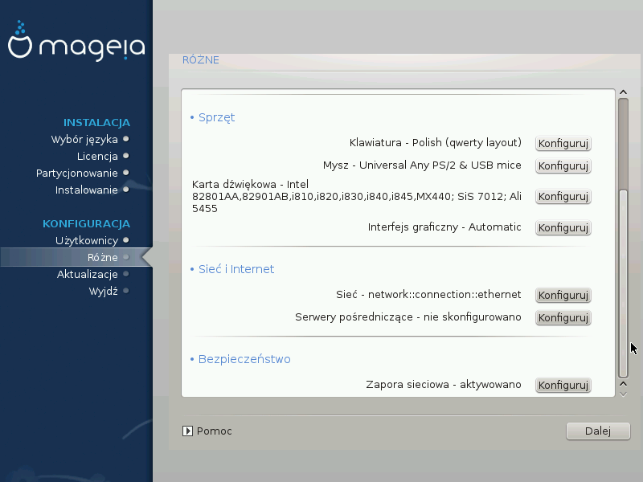

# Różne parametry

DrakX made smart choices for the configuration of your system depending on the choices you made and on the hardware DrakX detected. You can check the settings here and change them if you want after pressing Configure.

##System parameters

* Strefa czasowa

    DrakX selected a time zone for you, depending on your preferred language. You can change it if needed. See also „Konfiguruj strefę czasową”

* Country / Region

    If you are not in the selected country, it is very important that you correct the setting. See „Select your Country / Region”

* Bootloader

    DrakX has made good choices for the bootloader setting.

    Do not change anything, unless you know how to configure Grub and/or Lilo

    For more information, see „Podstawowe opcje programu rozruchowego”

* User management

    You can add extra users here. They will each get their own /home directories.

* Usługi:

    System services refer to those small programs which run the background (daemons). This tool allows you to enable or disable certain tasks.

    You should check carefully before changing anything here - a mistake may prevent your computer from operating correctly.

    For more information, see „Konfiguracja usług”

##Hardware parameters

 * Klawiatura:

    This is where you setup or change your keyboard layout which will depend on your location, language or type of keyboard.

 * Mysz:

    Here you can add or configure other pointing devices, tablets, trackballs etc.

 *  Karta dźwiękowa:

    The installer uses the default driver, if there is a default one. The option to select a different driver is only given when there is more than one driver for your card, but none of them is the default one.

*  Graphical interface:

    This section allows you to configure your graphic card(s) and displays.

    For more information, see „Graphic Card and Monitor Configuration”.

##Network and Internet parameters

* Sieć:

    You can configure your network here, but for network cards with non-free drivers it is better to do that after reboot, in the Mageia Control Center, if you have not yet enabled the Nonfree media repositories.

---

***Ostrzeżenie***

    When you add a network card, do not forget to set your firewall to watch that interface as well.

---

* Proxies:

    A Proxy Server acts as an intermediary between your computer and the wider internet. This section allows you to configure your computer to utilize a proxy service.

    You may need to consult your systems administrator to get the parameters you need to enter here

##Bezpieczeństwo

* Security Level:

    Here you set the Security level for your computer, in most cases the default setting (Standard) is adequate for general use.

    Check the option which best suits your usage.
* Firewall:

    A firewall is intended to be a barrier between your important data and the rascals out there on the internet who would compromise or steal it.

    Select the services that you wish to have access to your system. Your selections will depend on what you use your computer for.

---

***Ostrzeżenie***

    Bear in mind that allowing everything (no firewall) may be very risky.

---
