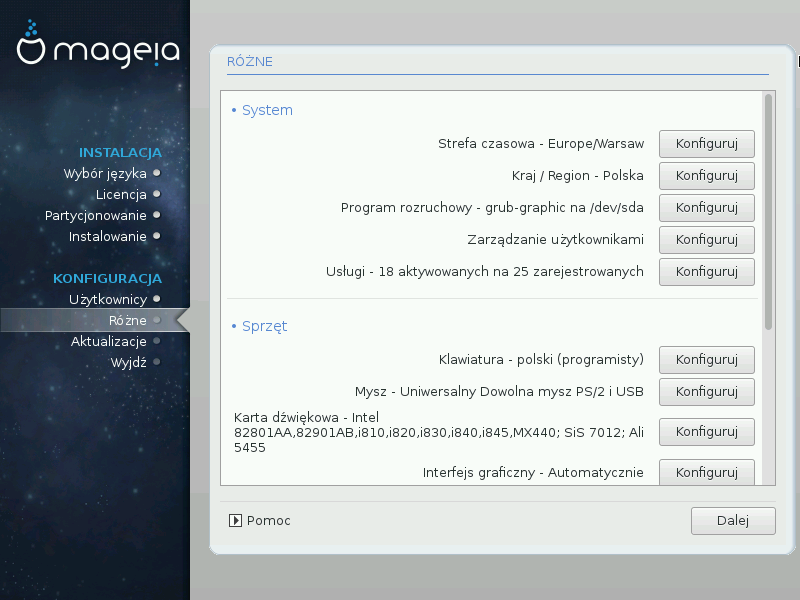
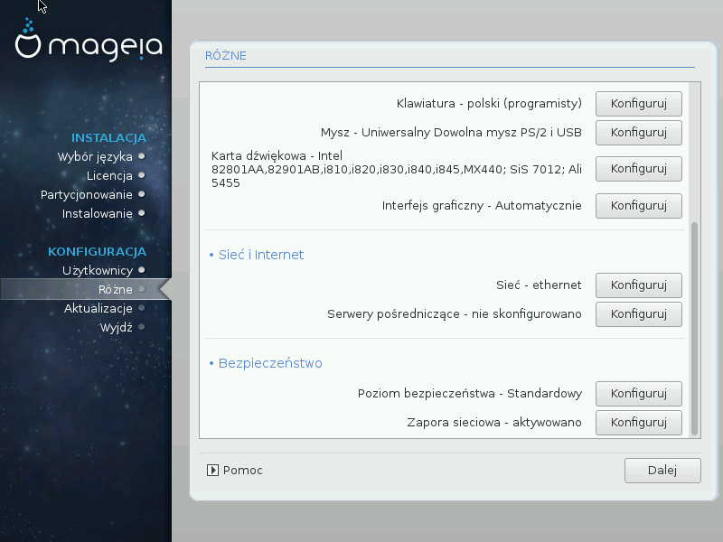

# Różne parametry systemowe

Instalator DrakX, opierając się na twoich poprzednich wyborach oraz na detekcji sprzętu, proponuje zazwyczaj bardzo rozsądne ustawienia konfiguracji różnych aspektów działania systemu. Na tym ekranie możesz dokonać ich przeglądu oraz pozmieniać niektóre z nich jeśli chcesz - kliknij **Konfiguruj**.

##System

* **Strefa czasowa**

    Instalator ustawia strefę czasową, na podstawie wybranego języka. Możesz ją oczywiście dowolnie zmieniać. Zobacz [Konfiguruj strefę czasową](./timezone.md).

* **Kraj / Region**

    Jeśli nie znajdujesz się w zaznaczonym kraju, jest bardzo ważne by poprawić to ustawienie. Zobacz [Kraj / Region](./country.md).

* **Program rozruchowy**

    DrakX dokonał odpowiednich ustawień programu rozruchowego.

    Nie zmieniaj ich, jeśli nie wiesz jak skonfigurować Grub.

    Aby uzyskać więcej informacji, zobacz [Podstawowe opcje programu rozruchowego](./bootloader.md).

* **Zarządzanie użytkownikami**

    Tutaj możesz utworzyć dodatkowych użytkowników. Dla każdego z nich zostanie utworzony katalog domowy - **/home/nazwa_użytkownika**.

* **Usługi**

    Usługi systemowe odnoszą się do tych niewielkich programów, które działają w tle (daemony). Tutaj możesz aktywować lub zdeaktywować ich uruchamianie przy starcie systemu.

    Należy zachować ostrożność, błąd w ustawieniach może spowodować że komputer nie będzie działał prawidłowo.

    Aby uzyskać więcej informacji, zobacz [Konfiguracja usług](./services.md).

##Parametry sprzętu

 * **Klawiatura**

    Tu można zmienić ustawienia klawiatury. Są one uzależnione od lokalizacji, wybranego języka oraz typu klawiatury.

 * **Mysz**

    Można tu również dodać i skonfigurować inne urządzenia wskazujące.

 *  **Karta dźwiękowa**

    Instalator ustawia domyślny sterownik, jeśli został on znaleziony. Jeśli istnieje możliwość ustawienia innego sterownika, można to zrobić tutaj.

*  **Interfejs graficzny**

    Konfiguracja karty graficznej oraz monitora.

    Aby uzyskać więcej informacji, zobacz [Konfiguracja monitora i karty graficznej](monitor.md).

##Sieć i Internet

* **Sieć**

    Tutaj można skonfigurować ustawienia sieci. Jeśli jednak posiadasz kartę obsługiwaną przez nie-wolne (non-free) sterowniki i nie włączyłeś repozytorium** Nonfree**, lepiej będzie zrobić to po restarcie systemu za pomocą **Centrum Sterowania Mageia**.

---

***Ostrzeżenie***

Jeśli dodasz kartę sieciową, nie zapomnij ustawić tak zaporę sieciową, aby dziłała również na nowym interfejsie.

---

* **Serwery pośredniczące**

    Serwery pośredniczące (proxy) działają jako pośrednik między twoim komputerem a siecią Internet. Ta sekcja pozwala na skonfigurowanie serwerów pośredniczących dla twojego komputera.

    Skonsultuj się z administratorem sieci jeśli nie znasz parametrów, które trzeba tu podać.

##Bezpieczeństwo

* **Poziom bezpieczeństwa**

    Tutaj można ustawić **Poziom bezpieczeństwa** dla swojego komputera, w większości przypadków domyślny poziom (Standardowy) jest odpowiedni.

* **Zapora sieciowa**

    Zapora sieciowa zwana też firewallem jest pomyślana jako bariera pomiędzy ważnymi danymi to be a baomputerze, a złoczyńcami ;) w Internecie którzy chcieli by je ukraść lub co gorsze przejąc kontrolę nad Twoim komputerem.

---

***Ostrzeżenie***

Pamiętaj, że udostępnienie wszystkiego (brak firewalla) może być bardzo ryzykowne.

---
