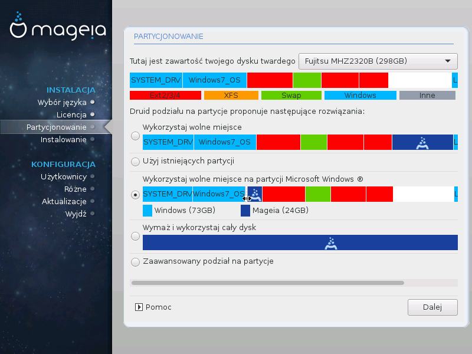

# Partycjonowanie

Na tym ekranie możesz zobaczyć zawartość twoich twardych dysków oraz propozycje instalatora dotyczące instalacji Magei.

Opcje dostępne na liście poniżej są zależne od podziału twojego dysku twardego oraz jego zawartości.

* **Użyj istniejących partycji**

    Jeśli dostępna jest ta opcja, oznacza to że zostały znalezione partycje linuksowe i mogą być użyte do instalacji.

* **Wykorzystaj wolne miejsce**

    Jeśli posiadasz nieużywane miejsce na dysku (niesformatowane), może być ono wykorzystane do instalacji Magei.

* **Wykorzystaj wolne miejsce na partycji Windows**

    Jeśli masz niewykorzystane miejsce na partycji Windows, instalator zaproponuje, aby je wykorzystać.

    To może być użyteczne rozwiązanie, aby przygotować miejsce na instalację Magei, jest to jednak ryzykowna operacja więc powinieneś się upewnić że masz kopię zapasową ważnych plików!

    Zauważ, że ta metoda spowoduje zmniejszenie rozmiaru partycji Windows. Partycja musi być "czysta", co oznacza, że Windows musi być poprawnie zamknięty za ostatnim razem gdy był używany. Musi być także zdefragmentowany, choć to nie daje pewności że wszystkie pliki zostały przesunięte poza obszar dysku, który zostanie użyty. Dlatego też bardzo wskazane jest zrobienie kopii zapasowej ważnych plików.

* **Wymaż i wykorzystaj cały dysk**

    Ta opcja użyje całego dysku dla Magei.

    Zauważ! **WSZYSTKIE** dane z wybranego dysku zostaną wymazane. Uważaj!

    Jeśli chcesz używać części tego dysku do czegoś innego, albo już masz na dysku dane, których nie chcesz stracić, nie używaj tej opcji.

* **Własne**

    Ta opcja daje Ci całkowitą kontrolę nad sposobem przeprowadzenia instalacji.

---

***Ostrzeżenie***

Niektóre nowe dysku używają 4096 bitowych sektorów logicznych, zamiast wcześniej standardowych 512 bitowych. Z powodu braku takiego sprzętu, narzędzie do partycjonowania użyte w instalatorze nie zostało przetestowane z takim dyskiem. Sugerujemy wcześniejsze przygotowanie takiego dysku, za pomocą innego narzędzia jak np. **gparted**. przy użyciu następujących ustawień:

"Align to" "MiB"

"Free space preceding (MiB)" "2"

Należy się także upewnić, aby wszystkie utworzone partycje miały parzystą liczbę megabajtów.

