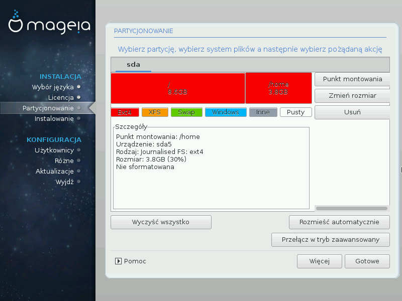

# Zaawansowany podział na partycje z pomocą DiskDrake

---

***Ostrzeżenie***

Jeśli chcesz zaszyfrować swoją partycję **/** musisz się upewnić, że posiadasz oddzielną partycję **/boot**. Partycja **/boot** nie może być zaszyfrowana, ponieważ uniemożliwiłoby to uruchomienie systemu.

---

Tutaj możesz dostosować podział swojego dysku na partycje. Możesz usuwać i tworzyć partycje, zmieniać system plików lub rozmiar partycji, a nawet sprawdzać co znajduje się na poszczególnych partycjach.

Dla każdego wykrytego dysku lub innego urządzenia, jak USB, prezentowana jest oddzielna karta. Na przykład sda, sdb i sdc jeśli zostały wykryte trzy urządzenia.

Kliknij **Wyczyść wszystko**, aby usunąć wszystkie partycje znajdujące się na wybranym dysku.

Dla wszystkich innych działań: najpierw kliknij na wybraną partycję. Następnie możesz wybrać system plików, punkt montowania, zmienić rozmiar lub ją usunąć.

Kontynuuj aż do momentu gdy skonfigurujesz wszystko zgodnie ze swoimi preferencjami.

Jeśli wszystko zostało już ustawione kliknij **Gotowe**.
