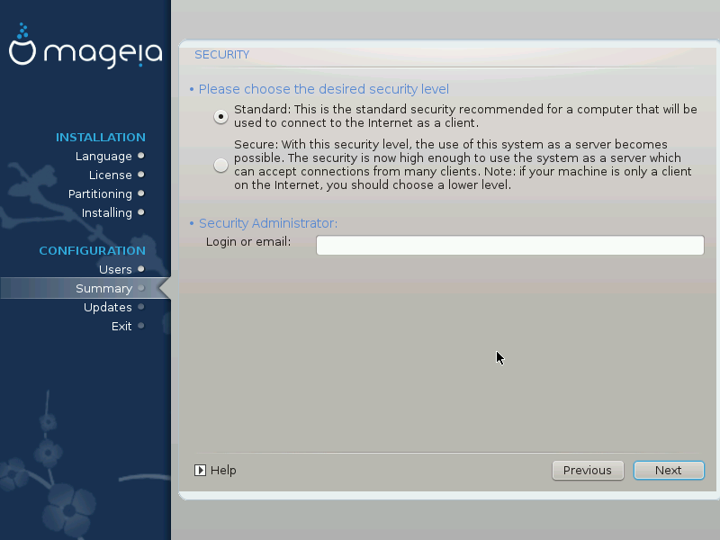

# Poziom bezpieczeństwa

Można tutaj ustawić poziom bezpieczeństwa.

Jeśli nie za bardzo się orientujesz pozostaw domyślne ustawienia - są one odpowiednio dobrane dla typowej instalacji na stacji roboczej.

Po instalacji, możliwa jest zawsze zmiana wszelkich ustawień dotyczących bezpieczeństwa za pomocą działu **Bezpieczeństwo** w **Centrum Sterowania Mageia**.

