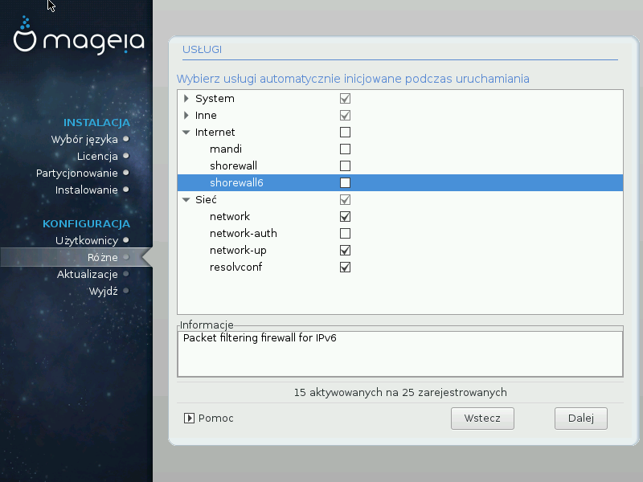

# Konfiguracja usług

Tutaj możemy ustawić jakie usługi (daemony) będą uruchamiane (lub nie) podczas startu systemu.

Są cztery grupy, kliknij na strzałkę przed nazwą grupy, aby zobaczyć wszystkie usługi przypisane do grupy.

Domyślne ustawienia zproponowane przez instalator DrakX są bezpieczne.

Po zaznaczeniu (podświetleniu) nazwy usługi, w okienku poniżej będ zaprezentowane krótkie informacje na jej temat.

Zmieniaj te ustawienia tylko jeśli dobrze wiesz co robisz.
