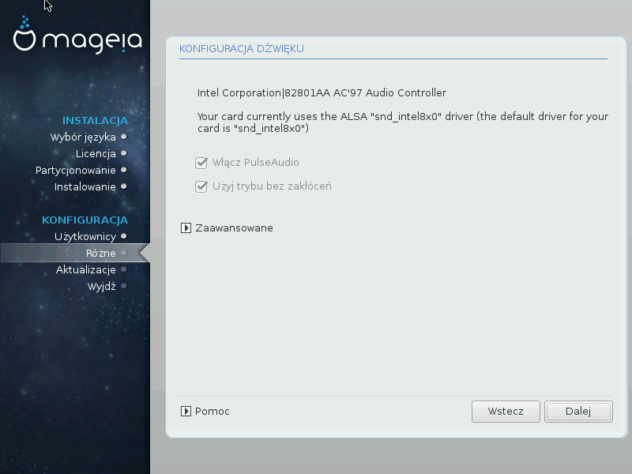

# Konfiguracja dźwięku

Na tym ekranie pokazana jest nazwa sterownika, który został wybrany przez instalator do obsługi twojej karty graficznej, będzie on domyślnym sterownikiem.

Domyślny sterownik powinien działać nie sprawiając problemów. Jeśli jednak po instalacji zauważysz nieprawidłowości, możesz skonfigurować sterownik za pomocą **Centrum Sterowania Mageia** (MCC), wybierając **Sprzęt**  oraz znajdującą się w prawym górnym rogu pozycję **Konfiguracja dźwięku**.

Klikając **Zaawansowane**, a następnie **Wyszukiwanie problemów** uzyskasz użyteczne informacje, które pozwolą ci rozwiązać problem.

####Zaawansowane

Kliknięcie **Zaawansowane** podczas instalacji może być użyteczne w sytuacji, gdy nie został wybrany domyślny sterownik, a są dostępne różne sterowniki, lub gdy uważasz, że instalator zaproponował nieodpowiedni sterownik.

Możesz wybrać inny sterownik klikając **Pozwól mi wybrać sterownik**.
