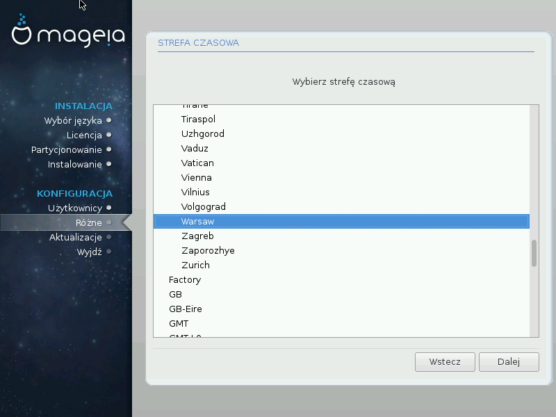

# Konfiguracja strefy czasowej

Wybierz swoją strefę czasową poprzez wybranie swojego kraju lub miasta w pobliżu w tej samej strefie czasowej.

In next screen you can choose to set your hardware clock to local time or to GMT, also known as UTC.

---

***Notatka***

If you have more than one operating system on your computer, make sure they are all set to local time, or all to UTC/GMT.

---
