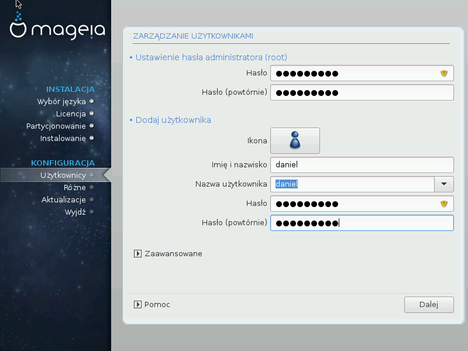

# Zarządzanie użytkownikami

##Ustawienie hasła administratora (root):

Wskazane jest, aby ustawić hasło administratora (root) w każdej instalacji Magei. Gdy wpisujesz hasło zmienia się kolor tarczy - z czerwonego poprzez żółty do zielonego - w zależności od siły hasła. Zielona tarcza sygnalizuje że używasz silnego hasła. Aby upewnić się, że nie popełniłeś literówki w haśle, musisz wpisać je po raz drugi w polu poniżej.

---

***Notatka***

We wszystkich hasłach rozróżniane są duże i małe litery, najlepiej użyć hasła zawierającego litery (duże i małe), numery oraz inne znaki.

---

##Dodawanie użytkownika

Tutaj dodajemy użytkownika. Użytkownik ma mniejsze uprawnienia od administratora (root), ale wystarczające, aby przeglądać Internet, używać pakietów biurowych lub grać w gry czy wykonywać wszystkie inne czynności, które wykonuje na swoim komputerze przeciętny użytkownik.

* **Ikona**: użycie tego przycisku zmieni ikonę użytkownika.

* **Imię i nazwisko**: Wpisz swoje imię i nazwisko do tego pola tekstowego

* **Nazwa użytkownika**: Tutaj wpisz nazwę użytkownika - będzie ona używana podczas logowania. Możesz też pozwolić, aby instalator wygenerował nazwę na podstawie imienia i nazwiska. Wielkość liter ma znaczenie.

* **Hasło**: W tym polu wpisz hasło użytkownika. Pojawi się w nim ikonka tarczy, która oznacza siłę hasła (Zobacz również Notatka)

* **Hasło (powtórnie)**: Wpisz powtórnie hasło użytkownika w tym polu, instalator sprawdzi czy hasła się zgadzają.

---

***Notatka***

Wszyscy użytkownicy, których dodasz podczas instalacji Magei, będą mieli katalogi domowe (dostępne do odczytu dla każdego, ale do zapisu tylko dla danego użytkownika)

Użytkownicy, których dodasz po zainstalowaniu systemu poprzez MCC - System - Zarządzanie użytkownikami będą posiadali katalogi domowe zabezpieczone przed odczytem oraz zapisem przez innych użytkowników.

Jeśli nie chcesz tworzyć użytkowników z katalogami domowymi możliwymi do odczytu przez innych, zaleca się utworzenie tylko tymczasowego użytkownika podczas instalacji i dodanie prawdziwych użytkowników po restarcie systemu.

If you prefer world readable home directories, you might want to add all extra needed users in the Configuration - Summary step during the install. Choose User management.

Ustawienia dostępu mogą być również zmienione po instalacji.

---

##Zaawansowane Zarządzanie Użytkownikami

Po kliknięciu na przycisk **Zaawansowane** będziesz miał możliwość edycji ustawień dla użytkownika którego dodajesz. Dodatkowo, możesz aktywować lub deaktywować konto gościa.

---

***Ostrzeżenie***

Wszystkie dane, które zapisze w swoim katalogu domowym gość zostaną wykasowane po jego wylogowaniu. Gość musi zapisywać ważne pliki na USB.

---

* **Aktywuj konto gościa**: Tutaj aktywujesz lub deaktywujesz konto gościa. Konto gościa pozwala na zalogowanie się i używanie komputera przez gości, ale posiada mniejsze uprawnienia niż zwykły użytkownik.

* **Powłoka**: Ta lista pozwala na zmianę powłoki używanej przez użytkownika, którego dodajesz, do wyboru Bash, Dash oraz Sh

* **User ID**: Here you can set the user ID for the user you are adding in the previous screen. This is a number. Leave it blank unless you know what you are doing.

* **Group ID**: This lets you set the group ID. Also a number, usually the same one as for the user. Leave it blank unless you know what you are doing.
