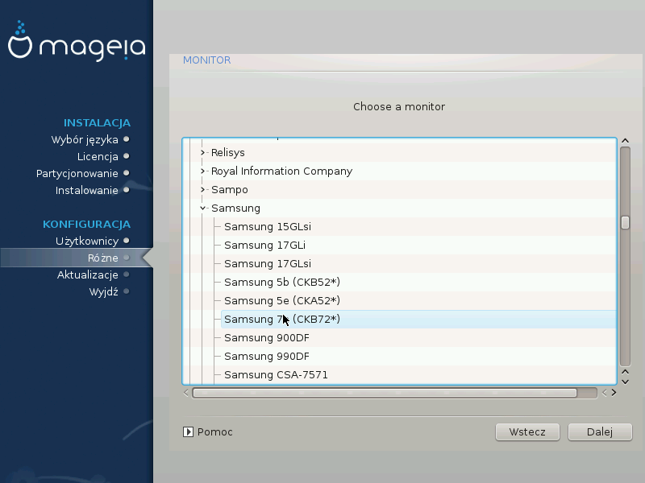

# Wybór monitora
Instalator DrakX posiada bardzo obszerną bazę monitorów, i zazwyczaj jest w stanie poprawnie je rozpoznać.

---

***Ostrzeżenie***

Wybór monitora o zupełnie innej charakterystyce niż posiadany może uszkodzić monitor lub kartę graficzną.
Nie próbuj więc tutaj przypadkowych opcji, jeśli nie za bardzo wiesz co robić. W razie problemów należy przeczytać dokumentację monitora.

---

#####Własne

Ta opcja pozwala na określenie dwóch ważnych parametrów, częstotliwości odświeżania poziomego oraz pionowego.

Jest BARDZO WAŻNE, aby nie ustawić tych parametrów poza zakresem możliwości monitora: można w ten sposób go uszkodzić. Jeśli masz kłopot, ustaw wartości bezpieczne oraz sprawdź dokumentację monitora.

#####Plug 'n Play

To jest domyślna opcja, instalator próbuje określić typ monitora za pomocą swojej bazy monitorów.

#####Dostawca

Jeśli instalator nie wykrył poprawnie twojego monitora, a wiesz jaki model posiadasz, możesz wybrać odpowiedni model z listy zaznaczając:

* dostawcę
* nazwę monitora

#####Standartowa

Wybranie tej opcji spowoduje wyświetlenie około 30 różnych możliwości konfiguracji jak 1024x768 @ 60Hz, zawierających także opcję używane w laptopach. To jest często dobra grupa jeśli chcesz użyć sterownika **vesa** dla kart które nie zostały rozpoznane automatycznie.
