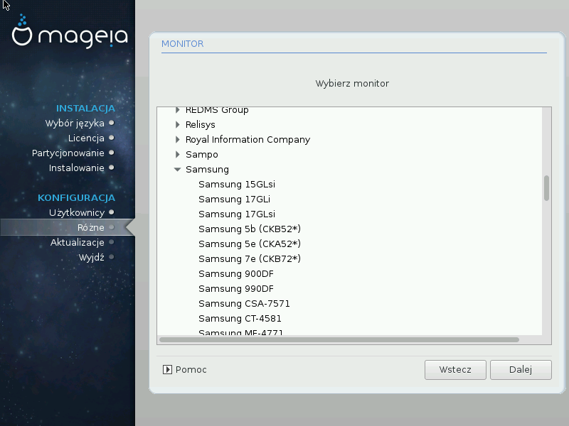

# Wybór monitora
DrakX has a very comprehensive database of monitors and will usually correctly identify yours.

---

***Ostrzeżenie***

Selecting a monitor with different characteristics could damage your monitor or video hardware. Please don't try something without knowing what you are doing. If in doubt you should consult your monitor documentation.

---

#####Własny

This option allows you to set two critical parameters, the vertical refresh rate and the horizontal sync rate. Vertical refresh determines how often the screen is refreshed and horizontal sync is the rate at which scan lines are displayed.

It is VERY IMPORTANT that you do not specify a monitor type with a sync range that is beyond the capabilities of your monitor: you may damage your monitor. If in doubt, choose a conservative setting and consult your monitor documentation.

#####Plug 'n Play

This is the default option and tries to determine the monitor type from the monitor database.

#####Dostawca

If the installer has not correctly detected your monitor and you know which one you have, you can select it from the tree by selecting:

* dostawca
* the monitor manufacturers name
* the monitor description

#####Generic

selecting this group displays nearly 30 display configurations such as 1024x768 @ 60Hz and includes Flat panel displays as used in laptops. This is often a good monitor selection group if you need to use the Vesa card driver when your video hardware cannot be determined automatically. Once again it may be wise to be conservative in your selections.
